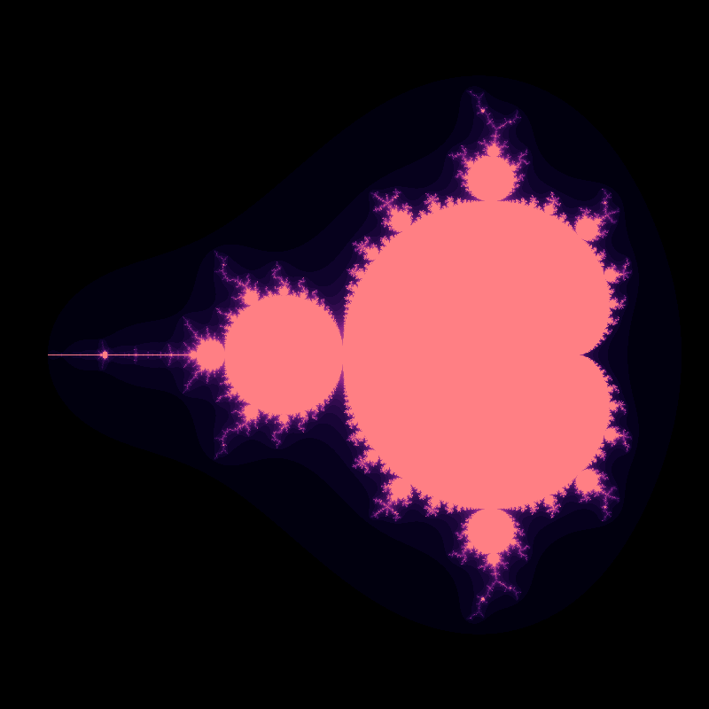

Laura Tebben  
M07411902  
9/10/2018

## Platform
Laptop processor: AMD A12-9700P Radeon R7, 10 Compute Cores 4C+6G 2.50 GHz  
Jupyter notebook: running 4 engines     
The programs are written in IPython. The parallel one uses the ipyparallel library to interface with Jupyter's engines.

## Results
I ran both the parallel and sequential programs 10 times to get the average run times.    
The sequential program averaged 29.48 seconds per run.  
The parallelized program averaged 15.18 seconds per run.  

## Code
### [Sequential](./fractal.ipynb)
``` python
# imports and basic notebook setup
from io import BytesIO
import numpy as np
from PIL import Image as PILImage, ImageDraw
from IPython.display import Image as ipImage, display
import time

import math, colorsys

def showarray(a, fmt='jpeg'):
    a = np.uint8(np.clip(a, 0, 255))
    f = BytesIO()
    PILImage.fromarray(a).save(f, fmt)
    display(ipImage(data=f.getvalue()))


dimensions = (800, 800)
scale = 1.0/(dimensions[0]/3)
center = (2.2, 1.5)   
iterate_max = 500
colors_max = 250

img = PILImage.new("RGB", dimensions)
d = ImageDraw.Draw(img)

# Calculate a tolerable palette
palette = [0] * colors_max
for i in range(colors_max):
    f = 1-abs((float(i)/colors_max-1)**15)
    r, g, b = colorsys.hsv_to_rgb(.66+f/3, 1-f/2, f)
    palette[i] = (int(r*255), int(g*255), int(b*255))

# Calculate the mandelbrot sequence for the point c with start value z
def iterate_mandelbrot(c, z = 0):
    for n in range(iterate_max + 1):
        z = z*z+c
        if abs(z) > 2:
            return n
    return None

def mandelbrot():
    for y in range(dimensions[1]):
        for x in range(dimensions[0]):
            c = complex(x * scale - center[0], y * scale - center[1])

            n = iterate_mandelbrot(c)

            if n is None:
                v = 1
            else:
                v = n/float(iterate_max)
            try:
                d.point((x, y), fill = palette[int(v * (colors_max-1))])
            except:
                print(int(v * (colors_max-1)))

# Draw our image
total = 0
for _ in range(10):
    start = time.time()
    mandelbrot()
    total += time.time() - start
print(total/10)

del d
img.save("result.png")
showarray(img)
```
Output:  


### [Parallel](./fractal_parallel.ipynb)
``` python
# imports and basic notebook setup
from io import BytesIO
import numpy as np
from PIL import Image as PILImage, ImageDraw
from IPython.display import Image as ipImage, display
import time
from ipyparallel import Client

import math, colorsys

def showarray(a, fmt='jpeg'):
    a = np.uint8(np.clip(a, 0, 255))
    f = BytesIO()
    PILImage.fromarray(a).save(f, fmt)
    display(ipImage(data=f.getvalue()))


dimensions = (800, 800)
img = PILImage.new("RGB", dimensions)
d = ImageDraw.Draw(img)

colors_max = 250

# Calculate a tolerable palette
palette = [0] * colors_max
for i in range(colors_max):
    f = 1-abs((float(i)/colors_max-1)**15)
    r, g, b = colorsys.hsv_to_rgb(.66+f/3, 1-f/2, f)
    palette[i] = (int(r*255), int(g*255), int(b*255))

# Calculate the mandelbrot sequence for the point c with start value z
def iterate_mandelbrot(c, iterate_max, z = 0):
    for n in range(iterate_max + 1):
        z = z*z+c
        if abs(z) > 2:
            return n
    return None

def mandelbrot(args):
    x, y = args
    dimensions = (800, 800)
    scale = 1.0/(dimensions[0]/3)
    center = (2.2, 1.5) 
    iterate_max = 500

    
    c = complex(x * scale - center[0], y * scale - center[1])
    
    z = 0
    flag = False
    for n in range(iterate_max + 1):
        z = z*z+c
        if abs(z) > 2:
            flag = True
            break

    v = 1
    if flag:
        v = n/float(iterate_max)
    
    return v


rc = Client()
dview = rc[:]

total = 0
for _ in range(10):
    start = time.time()
    colors = list(dview.map(mandelbrot, [(x,y) for y in range(800) for x in range(800)]))
    total += time.time()-start
print(total/10)

for x in range(len(colors)):
    v = x%800
    y = int(x/800)
    d.point((v, y), fill=palette[int(colors[x] * (colors_max-1))])

del d
img.save("result_parallel.png")
showarray(img)
```
Output:  


## References
Code for the sequential fractal:
http://0pointer.de/blog/projects/mandelbrot.html


Code I tried to use but didn't get good enough performance improvements so I just ended up referencing it for how to use ipyparallel
https://gist.github.com/joemilbourn/4030872
